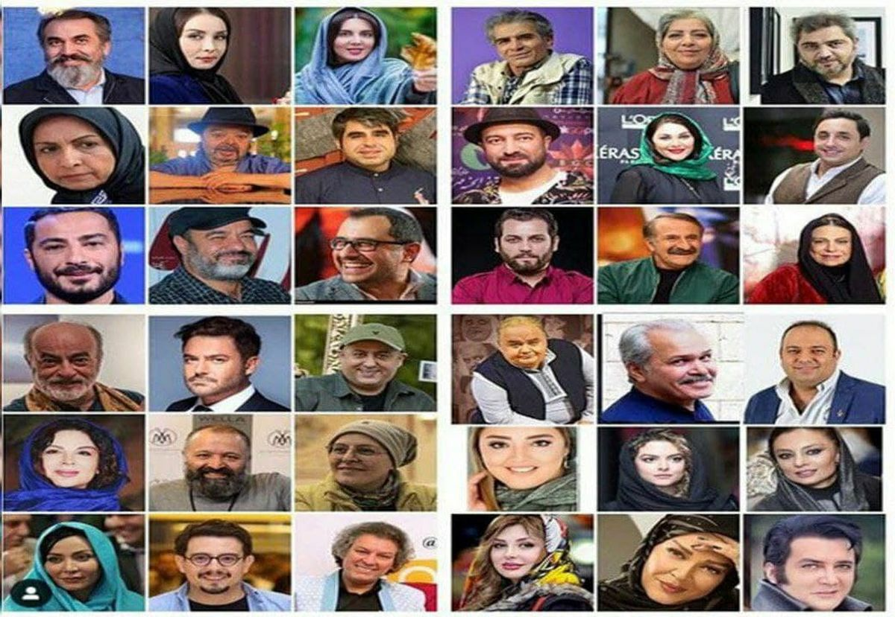
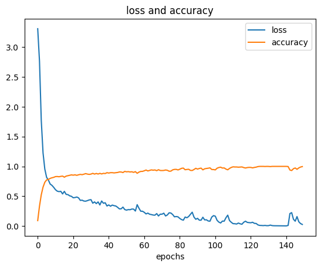

#  Face Recognition



## Discription 
Training and testing neural network using several photos of Iranian celebrities

##  How to install

```
pip install -r requirements.txt
```

## How to run

1. **Generate dataset**

[DeepFace](https://github.com/serengil/deepface)

 

2. **Train naural network**


| loss train   | accuracy  train    | 
| :---         | :---               |
|0.0260        | 0.9967             |


|  loss test   | accuracy test      |
| :---         | :---               |
|  1.9253      | 0.7857             |





We saved the results under the file ```weights/FaceRecognition_model.h5‍‍```. It can be used to execute the code with the same accuracy.


